# I. I2C
## 1. Struct of I2C
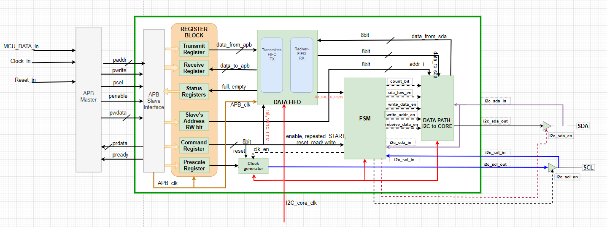
Bao gồm các khối sau:
- APB Slave Interface
- Register Block
- DATA FIFO
- Clock Generator
- FSM
- Data path i2c to core
## 2. Hoạt động của I2C
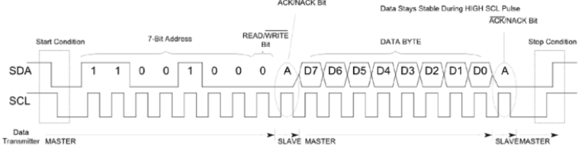

Các điều kiện hoạt động:

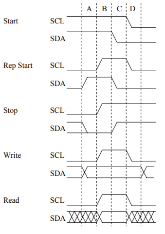

## 3. Registermap
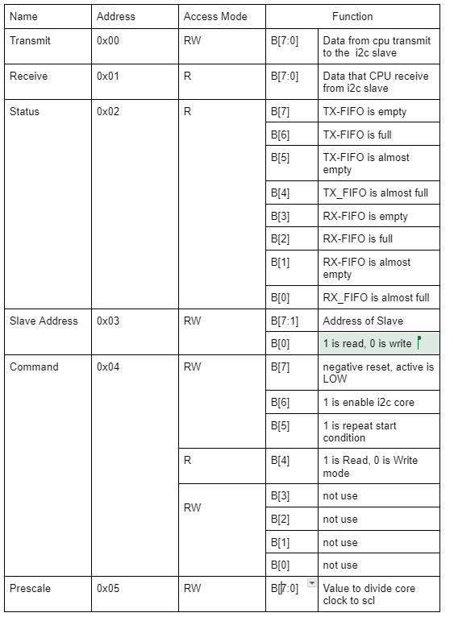

## 4. FSM
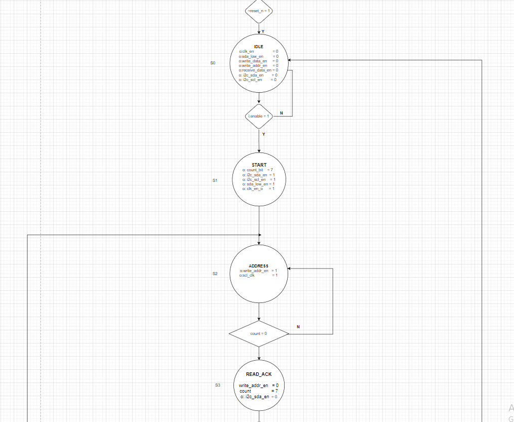
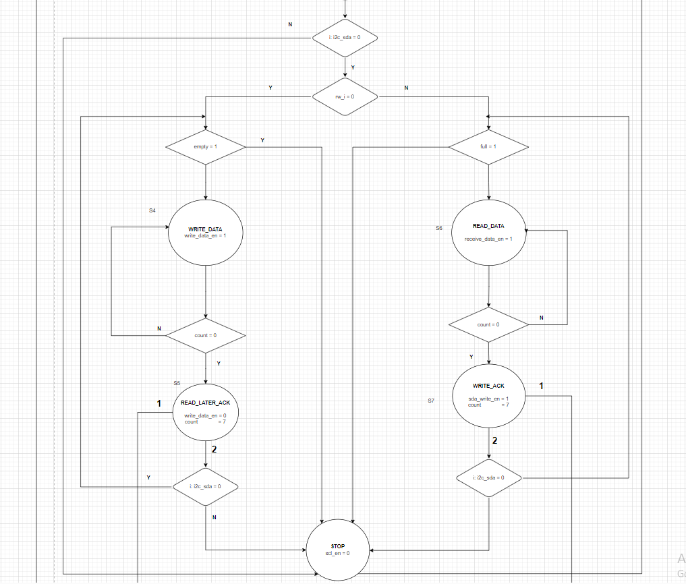
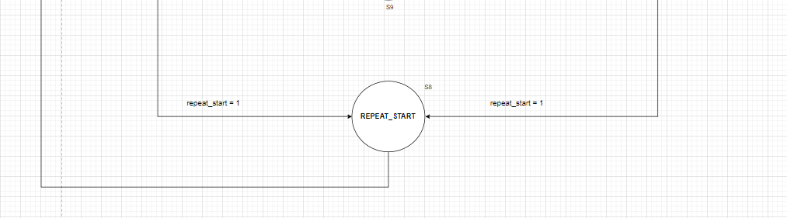

## 5. User guide
`Step 1: Reset APB and config`

    1.1. reset APB
	1.2. APB write data to FIFO
	1.3. Write slave’s address, bit 0 is 0 to write-mode
	1.4. Write prescale
	1.5. Write command to enable i2c core
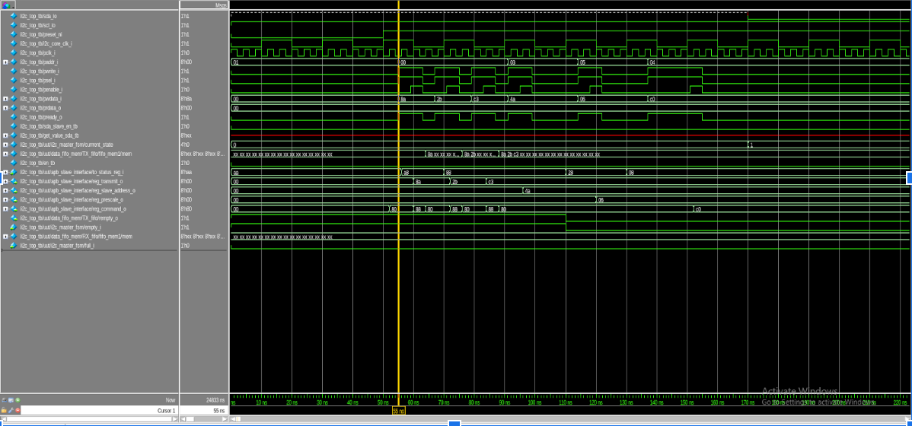

`Step 2 : Test write data`

    2.1. You can run until the FIFO is empty, then i2c will STOP.
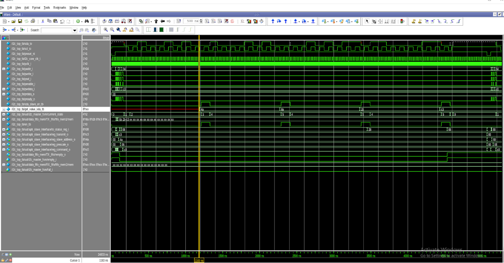

`Step 3: After STOP condition, you have to config command to enable again `

	3.1. Write slave’s address, bit 0 is 1 to read-mode
	3.2. Write prescale if changed
	3.3. Write command

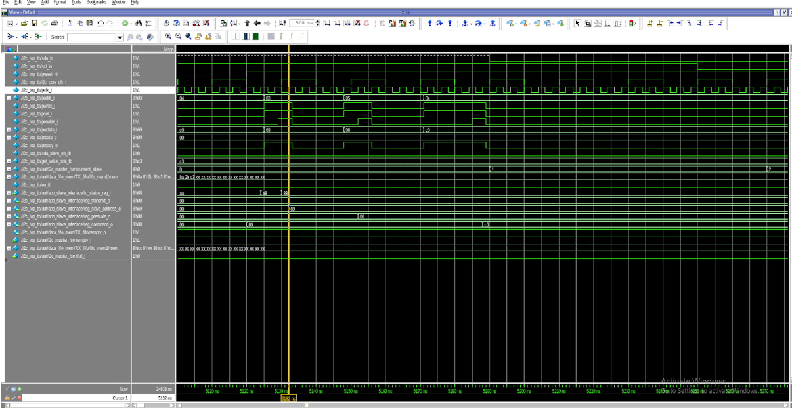

`Step 4: Slave ACK and then write data to sda`

    4.1. You can run until the FIFO is full, then i2c will STOP
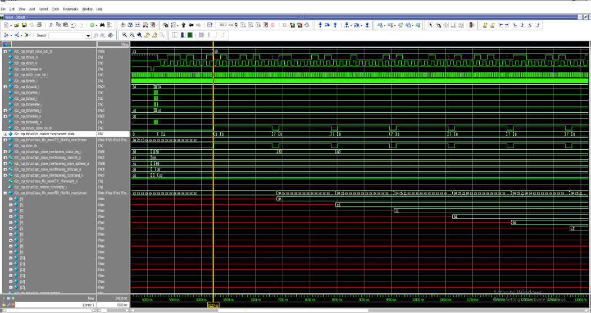

`Step 5: CPU read data from FIFO through APB interface`

    5.1. You need to config the APB at read-mode
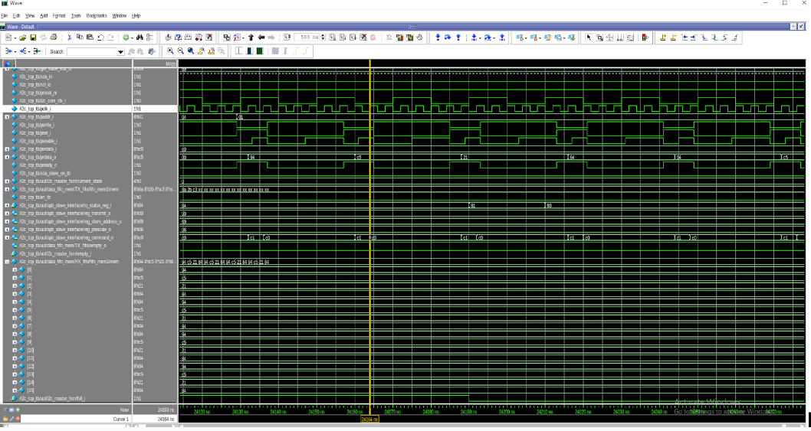

## 6. Verification 
`The architecture of top_tb to verification `

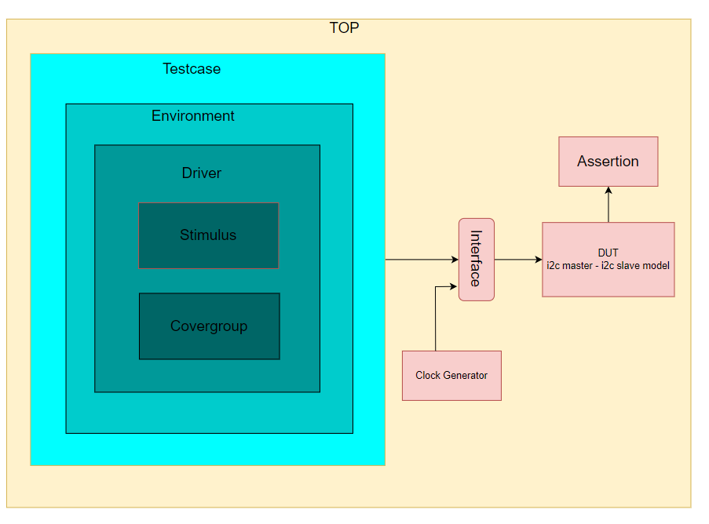
