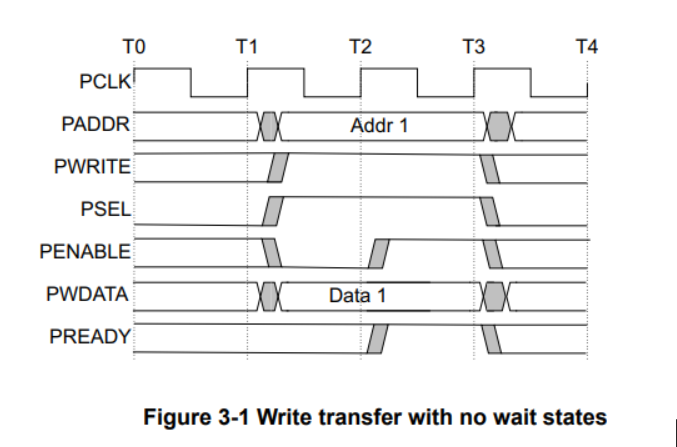
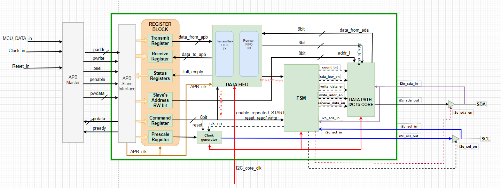
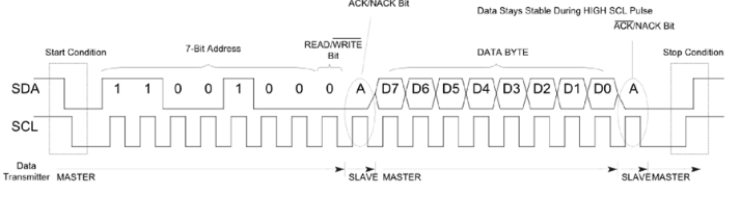
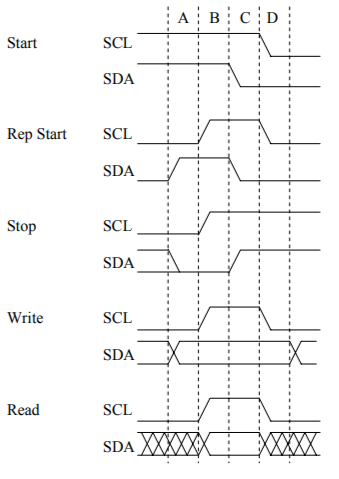

# i2c
 1.
 # Quato
 >đât là vid udj
 >nằm trong khung

 dùng dấu \`
 đây là `vis dụ`
 ## tạo bảng
 canh lề cho bảng bằng dấu :

 |STT|cột 1|cootj2 |
 | :-----| :--------| :-----:|
 |1|đây là ô 1|đây là ô 2|

 ## chèn link
 có thể chèn link bằng dấu ngoặc vuông là tròn
[Link](http://google.com)

## hình ảnh
Để chèn ảnh trong vscode cần để ảnh cùng folder với file.md này.
Cấu trúc:

# I. I2C
## 1. Struct of I2C

Bao gồm các khối sau:
- APB Slave Interface
- Register Block
- DATA FIFO
- Clock Generator
- FSM
- Data path i2c to core
## 2. Hoạt động của I2C

Các điều kiện hoạt động:

